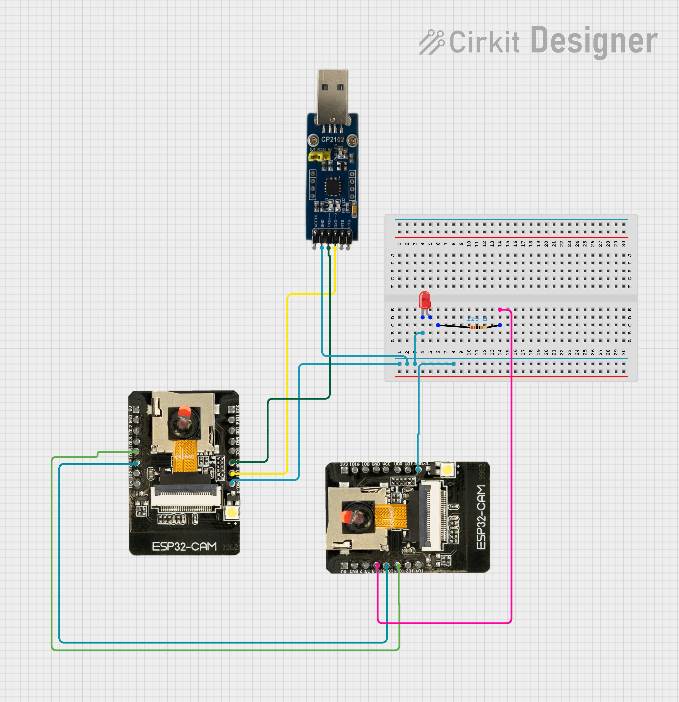
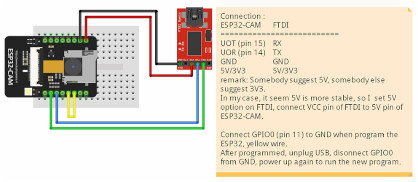

# **Circuit Documentation**

## **Summary of the Circuit**

This circuit involves the integration of two ESP32-CAM modules, a CP2102 USB to UART bridge, a red LED, and a resistor. The circuit is designed to facilitate communication between the ESP32-CAM modules and a computer via the CP2102, while also incorporating a visual indicator using the LED. The resistor is used to limit the current through the LED.

## **Connection of the programming device**

## **Component List**

1. **LED: Two Pin (red) \- Long Pins**  
   * **Description:** A standard red LED used as a visual indicator.  
   * **Pins:** Cathode, Anode  
2. **Resistor**  
   * **Description:** A 220 Ohm resistor used to limit current through the LED.  
   * **Pins:** Pin1, Pin2  
   * **Properties:** Resistance: 220 Ohms  
3. **CP2102**  
   * **Description:** A USB to UART bridge used for serial communication.  
   * **Pins:** VCC IO, GND, TXD, RXD, RTS, CTS  
4. **ESP32-CAM (Module 1\)**  
   * **Description:** A microcontroller with camera capabilities.  
   * **Pins:** 5V, GND, OI12, OI13, IO15, IO14, IO2, IO1, 3V3, IO16, IO0, VCC, UOR, UOT, GND/R  
5. **ESP32-CAM (Module 2\)**  
   * **Description:** Another instance of the ESP32-CAM microcontroller.  
   * **Pins:** 5V, GND, OI12, OI13, IO15, IO14, IO2, IO1, 3V3, IO16, IO0, VCC, UOR, UOT, GND/R

## **Wiring Details**

### **LED: Two Pin (red) \- Long Pins**

* **Cathode** is connected to:  
  * GND/R of ESP32-CAM (Module 1\)  
  * GND/R of ESP32-CAM (Module 2\)  
  * GND of CP2102  
* **Anode** is not connected in the provided net list.

### ---

**Resistor**

* **Pin1** is not connected in the provided net list.  
* **Pin2** is connected to:  
  * OI13 of ESP32-CAM (Module 2\)

### ---

**CP2102**

* **GND** is connected to:  
  * Cathode of LED  
  * GND/R of ESP32-CAM (Module 1\)  
  * GND/R of ESP32-CAM (Module 2\)  
* **RXD** is connected to:  
  * UOT of ESP32-CAM (Module 1\)  
* **TXD** is connected to:  
  * UOR of ESP32-CAM (Module 1\)  
* **Other pins (VCC IO, RTS, CTS)** are not connected in the provided net list.

### ---

**ESP32-CAM (Module 1\)**

* **GND/R** is connected to:  
  * Cathode of LED  
  * GND of CP2102  
  * GND/R of ESP32-CAM (Module 2\)  
* **UOT** is connected to:  
  * RXD of CP2102  
* **UOR** is connected to:  
  * TXD of CP2102  
* **IO14** is connected to:  
  * IO15 of ESP32-CAM (Module 2\)  
* **IO15** is connected to:  
  * IO14 of ESP32-CAM (Module 2\)  
* **Other pins (5V, OI12, IO2, IO1, 3V3, IO16, IO0, VCC)** are not connected in the provided net list.

### ---

**ESP32-CAM (Module 2\)**

* **GND/R** is connected to:  
  * Cathode of LED  
  * GND of CP2102  
  * GND/R of ESP32-CAM (Module 1\)  
* **OI13** is connected to:  
  * Pin2 of Resistor  
* **IO15** is connected to:  
  * IO14 of ESP32-CAM (Module 1\)  
* **IO14** is connected to:  
  * IO15 of ESP32-CAM (Module 1\)  
* **Other pins (5V, OI12, IO2, IO1, 3V3, IO16, IO0, VCC, UOR, UOT)** are not connected in the provided net list.

## **Documented Code**

There is no code provided for the microcontrollers in this circuit.